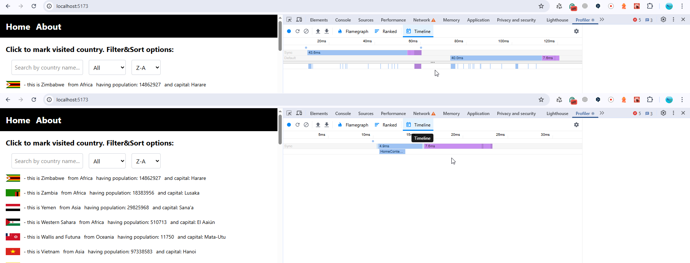
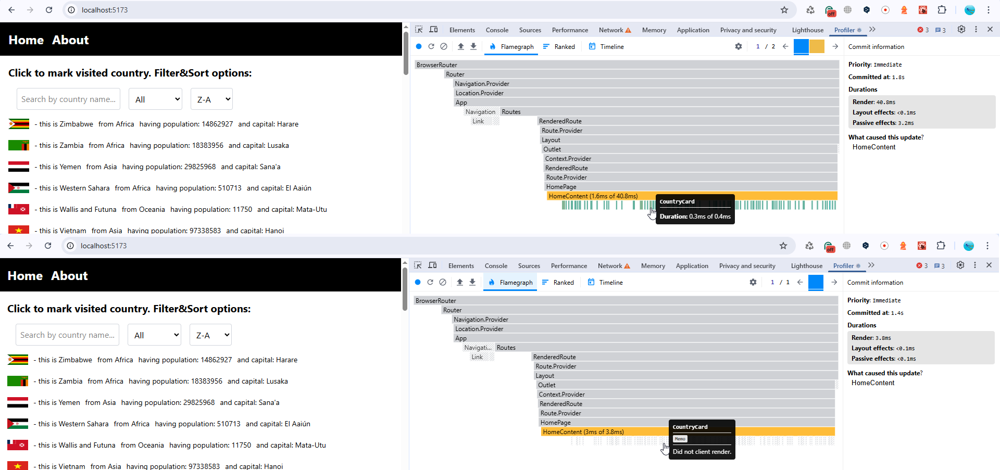
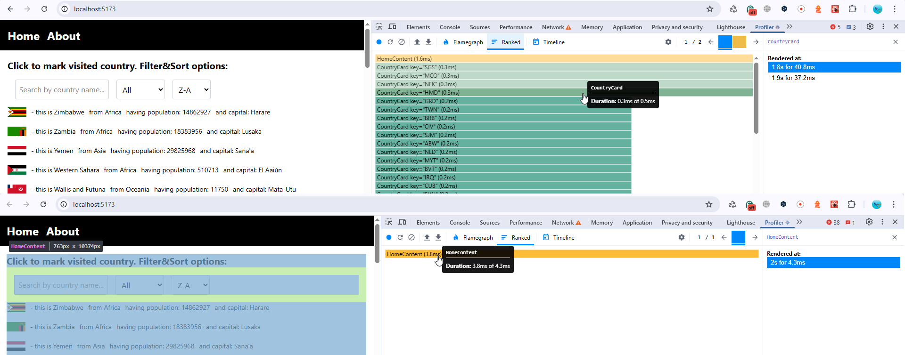

# React Performance Readme

Precondition: perf analysis includes 1 user action: sort Z-A after initial loading.

1. So having non-optimized (on top) and optimized (at bottom) timings at the pictures below I can conclude:

- Rendering time is drastically differs: 40ms vs 4.9ms, optimized app re-render app 9x times faster
- commit time did change, 7.6 ms in both cases
- also, having non-optimize version react did two re-render cycles, while optimized - only once, when user did the same operation: just sort countries by name Z-A.
  

2. Comparing individual components rendering in Flamegraph does not make sence, where 0.2-0.3ms each CountryCard in non-optimized version while "Did not client render" because of Memo in optimized version:
   

3. Comparing Ranked chart there is interesting observation: render of HomeContent is slower in optimized version (3.8ms) vs 1.6 ms in non optimized version (on the top). It seems optimizations added in the HomeContent component introduced some extra logic to compare dependencies and decide whether to re-render child components ot not, but this is not a visible delta, the difference is only 1.6ms, which provided us a much more powerful and fast component overall.

